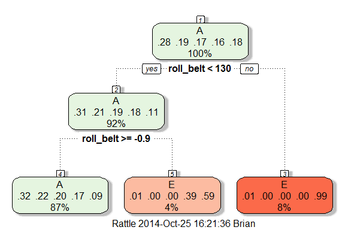

Practical Machine Learning - Prediction Assignment
===========
#### October 2014  

## Introduction  
The objective of this analysis is to build a machine learning algorithm that accurately predicts the fashion in which a human is performing a dumbell lift. The prediction is done using data captured from accelerometers that measure bodily movements of subjects performing the dumbell lifts.  

## Data Summary    
Six male subjects ranging in age between 20 - 28 years were fitted with accelerometers was placed on the belt, forearm, arm.  An additional accelerometer placed on the dumbell.  The subjects performed dumbell lifts in five different fashions, one correct way (class A), and four different incorrect ways (classes B, C, D, E).  Measurements from the accelerometers were caputured during the exercise in sliding time windows ranging from 0.5 to 2.5 seconds.   

The data source and the original study are from the paper *Qualitative Activity Recognition of Weight Lifting Exercieses*. (Velloso, E.; Bulling, A.; Gellersen, H.; Ugulino, W.; Fuks, H. Qualitative Activity Recognition of Weight Lifting Exercises. Proceedings of 4th International Conference in Cooperation with SIGCHI (Augmented Human '13) . Stuttgart, Germany: ACM SIGCHI, 2013.  Available at [http://groupware.les.inf.puc-rio.br/work.jsf?p1=11201][1])

## System Information
The analysis was done using R. The following packages are required for the analysis and presentation herein.  Full session information can be found at the end of this paper.  

```r
library(ggplot2)
library(grid)
library(gridExtra)
library(lattice)
library(caret)
library(rpart)
library(rpart.plot)
library(rattle)
library(randomForest)
```

## Data Source and Download  
As of October 25, 2014, the data was available at [https://d396qusza40orc.cloudfront.net/predmachlearn/pml-training.csv][2]

The data was downloaded and a preview in a text editor was done to identify potential strings that should be set to NA.  During the data import to R, strings matching "NA" and "#DIV/0!" were coerced to NA values in R.


```r
url <- "https://d396qusza40orc.cloudfront.net/predmachlearn/pml-training.csv"
filename <- "pml-training.csv"
# method for mac
download.file(url, destfile = filename, method = "curl")
# method for windows
# download.file(url, destfile = filename)
```
  

```r
filename <- "pml-training.csv"
data <- read.csv(filename, header = TRUE, na.strings = c("NA", "#DIV/0!"))
```


The import results in a dataframe with 19622 observations and 160 variables.

## Data Preparation    
### Data Cleaning  
First, the names of the variables were checked.  The analyst noticed that the first variable did not have a column header.  This variable is a pseudo row number, and thus was renamed as observationId.  Upon reviewing the variable names in the table below, the analyst noticed that meausres were grouped by accelerometer position, and that each group of variables shared the same meausures.  For each group there are raw measures (i.e. roll, pitch, yaw, x, y, and z measures), and statistical and summary measures (i.e. skewness, kurtosis, etc.). 


```r
colnames(data)[1] <- "observationId"
names(data)
```

```
##   [1] "observationId"            "user_name"               
##   [3] "raw_timestamp_part_1"     "raw_timestamp_part_2"    
##   [5] "cvtd_timestamp"           "new_window"              
##   [7] "num_window"               "roll_belt"               
##   [9] "pitch_belt"               "yaw_belt"                
##  [11] "total_accel_belt"         "kurtosis_roll_belt"      
##  [13] "kurtosis_picth_belt"      "kurtosis_yaw_belt"       
##  [15] "skewness_roll_belt"       "skewness_roll_belt.1"    
##  [17] "skewness_yaw_belt"        "max_roll_belt"           
##  [19] "max_picth_belt"           "max_yaw_belt"            
##  [21] "min_roll_belt"            "min_pitch_belt"          
##  [23] "min_yaw_belt"             "amplitude_roll_belt"     
##  [25] "amplitude_pitch_belt"     "amplitude_yaw_belt"      
##  [27] "var_total_accel_belt"     "avg_roll_belt"           
##  [29] "stddev_roll_belt"         "var_roll_belt"           
##  [31] "avg_pitch_belt"           "stddev_pitch_belt"       
##  [33] "var_pitch_belt"           "avg_yaw_belt"            
##  [35] "stddev_yaw_belt"          "var_yaw_belt"            
##  [37] "gyros_belt_x"             "gyros_belt_y"            
##  [39] "gyros_belt_z"             "accel_belt_x"            
##  [41] "accel_belt_y"             "accel_belt_z"            
##  [43] "magnet_belt_x"            "magnet_belt_y"           
##  [45] "magnet_belt_z"            "roll_arm"                
##  [47] "pitch_arm"                "yaw_arm"                 
##  [49] "total_accel_arm"          "var_accel_arm"           
##  [51] "avg_roll_arm"             "stddev_roll_arm"         
##  [53] "var_roll_arm"             "avg_pitch_arm"           
##  [55] "stddev_pitch_arm"         "var_pitch_arm"           
##  [57] "avg_yaw_arm"              "stddev_yaw_arm"          
##  [59] "var_yaw_arm"              "gyros_arm_x"             
##  [61] "gyros_arm_y"              "gyros_arm_z"             
##  [63] "accel_arm_x"              "accel_arm_y"             
##  [65] "accel_arm_z"              "magnet_arm_x"            
##  [67] "magnet_arm_y"             "magnet_arm_z"            
##  [69] "kurtosis_roll_arm"        "kurtosis_picth_arm"      
##  [71] "kurtosis_yaw_arm"         "skewness_roll_arm"       
##  [73] "skewness_pitch_arm"       "skewness_yaw_arm"        
##  [75] "max_roll_arm"             "max_picth_arm"           
##  [77] "max_yaw_arm"              "min_roll_arm"            
##  [79] "min_pitch_arm"            "min_yaw_arm"             
##  [81] "amplitude_roll_arm"       "amplitude_pitch_arm"     
##  [83] "amplitude_yaw_arm"        "roll_dumbbell"           
##  [85] "pitch_dumbbell"           "yaw_dumbbell"            
##  [87] "kurtosis_roll_dumbbell"   "kurtosis_picth_dumbbell" 
##  [89] "kurtosis_yaw_dumbbell"    "skewness_roll_dumbbell"  
##  [91] "skewness_pitch_dumbbell"  "skewness_yaw_dumbbell"   
##  [93] "max_roll_dumbbell"        "max_picth_dumbbell"      
##  [95] "max_yaw_dumbbell"         "min_roll_dumbbell"       
##  [97] "min_pitch_dumbbell"       "min_yaw_dumbbell"        
##  [99] "amplitude_roll_dumbbell"  "amplitude_pitch_dumbbell"
## [101] "amplitude_yaw_dumbbell"   "total_accel_dumbbell"    
## [103] "var_accel_dumbbell"       "avg_roll_dumbbell"       
## [105] "stddev_roll_dumbbell"     "var_roll_dumbbell"       
## [107] "avg_pitch_dumbbell"       "stddev_pitch_dumbbell"   
## [109] "var_pitch_dumbbell"       "avg_yaw_dumbbell"        
## [111] "stddev_yaw_dumbbell"      "var_yaw_dumbbell"        
## [113] "gyros_dumbbell_x"         "gyros_dumbbell_y"        
## [115] "gyros_dumbbell_z"         "accel_dumbbell_x"        
## [117] "accel_dumbbell_y"         "accel_dumbbell_z"        
## [119] "magnet_dumbbell_x"        "magnet_dumbbell_y"       
## [121] "magnet_dumbbell_z"        "roll_forearm"            
## [123] "pitch_forearm"            "yaw_forearm"             
## [125] "kurtosis_roll_forearm"    "kurtosis_picth_forearm"  
## [127] "kurtosis_yaw_forearm"     "skewness_roll_forearm"   
## [129] "skewness_pitch_forearm"   "skewness_yaw_forearm"    
## [131] "max_roll_forearm"         "max_picth_forearm"       
## [133] "max_yaw_forearm"          "min_roll_forearm"        
## [135] "min_pitch_forearm"        "min_yaw_forearm"         
## [137] "amplitude_roll_forearm"   "amplitude_pitch_forearm" 
## [139] "amplitude_yaw_forearm"    "total_accel_forearm"     
## [141] "var_accel_forearm"        "avg_roll_forearm"        
## [143] "stddev_roll_forearm"      "var_roll_forearm"        
## [145] "avg_pitch_forearm"        "stddev_pitch_forearm"    
## [147] "var_pitch_forearm"        "avg_yaw_forearm"         
## [149] "stddev_yaw_forearm"       "var_yaw_forearm"         
## [151] "gyros_forearm_x"          "gyros_forearm_y"         
## [153] "gyros_forearm_z"          "accel_forearm_x"         
## [155] "accel_forearm_y"          "accel_forearm_z"         
## [157] "magnet_forearm_x"         "magnet_forearm_y"        
## [159] "magnet_forearm_z"         "classe"
```

Machine learning algorithms work on data without missing values, thus variables with missing values were eliminated.  

```r
# create a T/F vector identify variables with at least one NA
missingcols <- sapply(data, function(x) { any(is.na(x)) })

# replace data by keeping only those variables that don't have missing data
data <- data[ , !missingcols]
```

Interestingly, all the statistical and summary measures, except for total acceleration measures, contained missing values, and were eliminated.  The resulting dataset includes the identifying observation variables [1 -7], the raw accelerometer measurements plus the summary variable total acceleartion [8 - 59], and the fashion in which the exercise was performed (classe) [60]. 

```r
names(data)
```

```
##  [1] "observationId"        "user_name"            "raw_timestamp_part_1"
##  [4] "raw_timestamp_part_2" "cvtd_timestamp"       "new_window"          
##  [7] "num_window"           "roll_belt"            "pitch_belt"          
## [10] "yaw_belt"             "total_accel_belt"     "gyros_belt_x"        
## [13] "gyros_belt_y"         "gyros_belt_z"         "accel_belt_x"        
## [16] "accel_belt_y"         "accel_belt_z"         "magnet_belt_x"       
## [19] "magnet_belt_y"        "magnet_belt_z"        "roll_arm"            
## [22] "pitch_arm"            "yaw_arm"              "total_accel_arm"     
## [25] "gyros_arm_x"          "gyros_arm_y"          "gyros_arm_z"         
## [28] "accel_arm_x"          "accel_arm_y"          "accel_arm_z"         
## [31] "magnet_arm_x"         "magnet_arm_y"         "magnet_arm_z"        
## [34] "roll_dumbbell"        "pitch_dumbbell"       "yaw_dumbbell"        
## [37] "total_accel_dumbbell" "gyros_dumbbell_x"     "gyros_dumbbell_y"    
## [40] "gyros_dumbbell_z"     "accel_dumbbell_x"     "accel_dumbbell_y"    
## [43] "accel_dumbbell_z"     "magnet_dumbbell_x"    "magnet_dumbbell_y"   
## [46] "magnet_dumbbell_z"    "roll_forearm"         "pitch_forearm"       
## [49] "yaw_forearm"          "total_accel_forearm"  "gyros_forearm_x"     
## [52] "gyros_forearm_y"      "gyros_forearm_z"      "accel_forearm_x"     
## [55] "accel_forearm_y"      "accel_forearm_z"      "magnet_forearm_x"    
## [58] "magnet_forearm_y"     "magnet_forearm_z"     "classe"
```

### Cross Validation  
The dataset is large enough to perform cross validation using a 70/30 split of training and testing data.  An arbitrary seed was set to assure reproducibility, and the training and testing sets were created using *createDataPartition* from the *caret* package.  The dimensions of the resulting datasets were confirmed through output.  

```r
# set seed
set.seed(123)

# create training and test sets
inTrain <- caret::createDataPartition(y = data$classe, p = 0.7, list = FALSE)

# subset
training <- data[inTrain, ]
testing <- data[-inTrain, ]
```


The training set has 13737 observations and 60 variables.  
The testing set has 5885 observations and 60 variables.  

## Exploratory Analysis  
Using only the training set, the anlayst embarked on explortory analysis.  

Looking at boxplots of belt measures on roll, pitch, yaw, and total acceleation grouped by the method in which the barbell lift was performed.  It is clear that the median values of method A differs greatly from the methods B, C, D, and E in roll, yaw, and acceleartion.  However, it does not appear there are distinguishing median values that would help classify methods B, C, D, and E from each other. 


```r
#four ggplot boxplots
p.roll.belt <- ggplot(training, aes(classe, roll_belt))
p.roll.belt <- p.roll.belt + geom_boxplot() + ggtitle("Roll Belt")
p.pitch.belt <- ggplot(training, aes(classe, pitch_belt))
p.pitch.belt <- p.pitch.belt + geom_boxplot() + ggtitle("Pitch Belt")
p.yaw.belt <- ggplot(training, aes(classe, yaw_belt))
p.yaw.belt <- p.yaw.belt + geom_boxplot() + ggtitle("Yaw Belt")
p.accel.belt <- ggplot(training, aes(classe, total_accel_belt))
p.accel.belt <- p.accel.belt + geom_boxplot() + ggtitle("Total Accel Belt")
gridExtra::grid.arrange(p.roll.belt, p.pitch.belt, p.yaw.belt, p.accel.belt, ncol = 2, nrow = 2)
```

 

## Simple Decision Tree Model
Even though it did not seem that the methods could be classified using only roll belt, ptich belt, yaw belt, and total acceleration belt, the analyst was curious on how accurate a simple decision tree model could be using only these four measures as predictors.  The decision tree was run with 25 reps of bootstrapping.  


```r
# simple decision tree model, isolating the class (60) as the outcome and 
# variables 8 - 11 as predictors  
modFit <- caret::train(classe ~ ., method = "rpart", data = training[,c(8:11,60)])
```

The resulting dendogram shows that the resulting decision tree classifies methods as either A or E only.  

```r
rattle::fancyRpartPlot(modFit$finalModel)
```

 

### Decision Tree Accuracy and Predictions  
Given that the decision tree did not classify any methods as B, C, or D, the analyst expected that the prediction accuracy rate would be low.  This was confirmed by cross validation, making classification predictions on the testing set using the model built with the training set.  


```r
# make sure to use the same variables from the testing set as were used in the training set.  
predictions <- predict(modFit, newdata = testing[,c(8:11,60)])
```

The accuracy was only 39.2% as shown in the confusion matrix.  


```r
# output confusion matrix
confusionMatrix(predictions, testing$classe)
```

```
## Confusion Matrix and Statistics
## 
##           Reference
## Prediction    A    B    C    D    E
##          A 1664 1139 1026  874  439
##          B    0    0    0    0    0
##          C    0    0    0    0    0
##          D    0    0    0    0    0
##          E   10    0    0   90  643
## 
## Overall Statistics
##                                           
##                Accuracy : 0.392           
##                  95% CI : (0.3795, 0.4046)
##     No Information Rate : 0.2845          
##     P-Value [Acc > NIR] : < 2.2e-16       
##                                           
##                   Kappa : 0.1651          
##  Mcnemar's Test P-Value : NA              
## 
## Statistics by Class:
## 
##                      Class: A Class: B Class: C Class: D Class: E
## Sensitivity            0.9940   0.0000   0.0000   0.0000   0.5943
## Specificity            0.1741   1.0000   1.0000   1.0000   0.9792
## Pos Pred Value         0.3236      NaN      NaN      NaN   0.8654
## Neg Pred Value         0.9865   0.8065   0.8257   0.8362   0.9146
## Prevalence             0.2845   0.1935   0.1743   0.1638   0.1839
## Detection Rate         0.2828   0.0000   0.0000   0.0000   0.1093
## Detection Prevalence   0.8737   0.0000   0.0000   0.0000   0.1263
## Balanced Accuracy      0.5840   0.5000   0.5000   0.5000   0.7867
```

While the code and output is not shown here, a simple decision tree was run using all variables as predictors.  Even with such a model, the prediction accuracy was only 55.2%.  Thus, the analyst decided to pursue a random forest algorithm to achieve a better prediction rate.  


## Random Forest Model  
A random forest model was built using all of the prediction variables and the classe variable as the categorical outcome.  A random forest was attempted with the train function from the caret package and also with the randomForest function from the randomForest package.  The analyst let the train function run for 75 minutes and the function never completed.  The randomForest method ran in under two minutes, and thus the randomForest method was used to build the random forest.  


```r
# random forest using all predictors
# using 
modFit.rf <- randomForest::randomForest(classe ~ ., data = training[,c(8:60)])
# caret random forest.  never completed
# tr <- trainControl(method = "repeatedcv", number = 5 )
# modFit.rf <- caret::train(classe ~., data = training[,c(8:60)], method = "rf", prox = TRUE, trControl = tr)
```

The resulting in-sample out-of-bag estimate of error rate was 0.52%.  This is the error rate expected if the model was applied to a real world dataset that was not used to train the model.  By setting aside 30% of the original dataset as a testing set, which was not used to train the random forest model at all, a pseudo-real world dataset is available to test to the accuracy of the model.  


```r
modFit.rf
```

```
## 
## Call:
##  randomForest(formula = classe ~ ., data = training[, c(8:60)]) 
##                Type of random forest: classification
##                      Number of trees: 500
## No. of variables tried at each split: 7
## 
##         OOB estimate of  error rate: 0.52%
## Confusion matrix:
##      A    B    C    D    E class.error
## A 3902    2    0    0    2 0.001024066
## B   11 2644    3    0    0 0.005267118
## C    0   16 2377    3    0 0.007929883
## D    0    0   24 2227    1 0.011101243
## E    0    0    3    6 2516 0.003564356
```

### Random Forest Evaluation  

#### Predictions  
According to Leo Breiman and Adele Cutler, the founders of random forests, "there is no need for cross-valdiation or a separate test set to get an unbiased estimate of the test set error." (see [https://www.stat.berkeley.edu/~breiman/RandomForests/cc_home.htm#ooberr][3])  However, using the testing set, the prediction out-of-sample estimate of error can be confirmed through cross-validation.  The analyst made predictions of the testing set against the random model and the resulting confusion matrix is shown.  The accuracy is reported at 99.44%, thus an out-of-sample error rate of 0.54%, which is very close to the in-sample estimate of error rate of 0.52%.  


```r
predictions.rf <- predict(modFit.rf, newdata = testing[,c(8:60)])
confusionMatrix(predictions.rf, testing$classe)
```

```
## Confusion Matrix and Statistics
## 
##           Reference
## Prediction    A    B    C    D    E
##          A 1673    6    0    0    0
##          B    1 1133   11    0    0
##          C    0    0 1015   14    0
##          D    0    0    0  949    0
##          E    0    0    0    1 1082
## 
## Overall Statistics
##                                           
##                Accuracy : 0.9944          
##                  95% CI : (0.9921, 0.9961)
##     No Information Rate : 0.2845          
##     P-Value [Acc > NIR] : < 2.2e-16       
##                                           
##                   Kappa : 0.9929          
##  Mcnemar's Test P-Value : NA              
## 
## Statistics by Class:
## 
##                      Class: A Class: B Class: C Class: D Class: E
## Sensitivity            0.9994   0.9947   0.9893   0.9844   1.0000
## Specificity            0.9986   0.9975   0.9971   1.0000   0.9998
## Pos Pred Value         0.9964   0.9895   0.9864   1.0000   0.9991
## Neg Pred Value         0.9998   0.9987   0.9977   0.9970   1.0000
## Prevalence             0.2845   0.1935   0.1743   0.1638   0.1839
## Detection Rate         0.2843   0.1925   0.1725   0.1613   0.1839
## Detection Prevalence   0.2853   0.1946   0.1749   0.1613   0.1840
## Balanced Accuracy      0.9990   0.9961   0.9932   0.9922   0.9999
```


This plot shows the class error rates of the random forest model.  As the number of trees increases, the error rate approaches zero.  

```r
plot(modFit.rf, main = "Error rate of random forest")
```

 


#### Importance of Variables  

According to [https://dinsdalelab.sdsu.edu/metag.stats/code/randomforest.html][4], "the mean decrease in Gini coefficient is a measure of how each variable contributes to the homogeneity of the nodes and leaves in the resulting random forest...Variables that result in nodes with higher purity have a higheer decrease in Gini cofficient."  This importance chart displays the variables that affected the random forest, from greatest impact to least impact, from top to bottom.  Euler angle measurments from the belt (roll, yaw, and pitch) and measurements from the dumbell magnetometer have a strong impact on distinguishing the method class.  The Euler angle roll from the forearm also has an impact on the model.  Other measurements have a smaller increasing impact.  


```r
varImpPlot(modFit.rf, pch = 20, main = "Importance of Variables")
```

 

This concludes the report.  


## Session Info

```
## R version 3.1.0 (2014-04-10)
## Platform: x86_64-w64-mingw32/x64 (64-bit)
## 
## locale:
## [1] LC_COLLATE=English_United States.1252 
## [2] LC_CTYPE=English_United States.1252   
## [3] LC_MONETARY=English_United States.1252
## [4] LC_NUMERIC=C                          
## [5] LC_TIME=English_United States.1252    
## 
## attached base packages:
## [1] grid      stats     graphics  grDevices utils     datasets  methods  
## [8] base     
## 
## other attached packages:
## [1] randomForest_4.6-10 rattle_3.3.0        rpart.plot_1.4-4   
## [4] rpart_4.1-8         caret_6.0-35        lattice_0.20-29    
## [7] gridExtra_0.9.1     ggplot2_1.0.0      
## 
## loaded via a namespace (and not attached):
##  [1] BradleyTerry2_1.0-5 brglm_0.5-9         car_2.0-21         
##  [4] class_7.3-10        codetools_0.2-8     colorspace_1.2-4   
##  [7] compiler_3.1.0      digest_0.6.4        e1071_1.6-4        
## [10] evaluate_0.5.5      foreach_1.4.2       formatR_1.0        
## [13] gtable_0.1.2        gtools_3.4.1        htmltools_0.2.6    
## [16] iterators_1.0.7     knitr_1.7           labeling_0.2       
## [19] lme4_1.1-7          MASS_7.3-34         Matrix_1.1-3       
## [22] minqa_1.2.4         munsell_0.4.2       nlme_3.1-117       
## [25] nloptr_1.0.4        nnet_7.3-8          plyr_1.8.1         
## [28] proto_0.3-10        RColorBrewer_1.0-5  Rcpp_0.11.1        
## [31] reshape2_1.4        rmarkdown_0.2.64    scales_0.2.4       
## [34] splines_3.1.0       stringr_0.6.2       tools_3.1.0        
## [37] yaml_2.1.11
```

[1]: http://groupware.les.inf.puc-rio.br/work.jsf?p1=11201 
[2]: https://d396qusza40orc.cloudfront.net/predmachlearn/pml-training.csv
[3]: https://www.stat.berkeley.edu/~breiman/RandomForests/cc_home.htm#ooberr
[4]: https://dinsdalelab.sdsu.edu/metag.stats/code/randomforest.html  
